# 0x1lSpace Database Schema

> PostgreSQL 16 — 6 modules, 49 tables, 1 materialized view

---

## 1. Auth & User (6 tables)

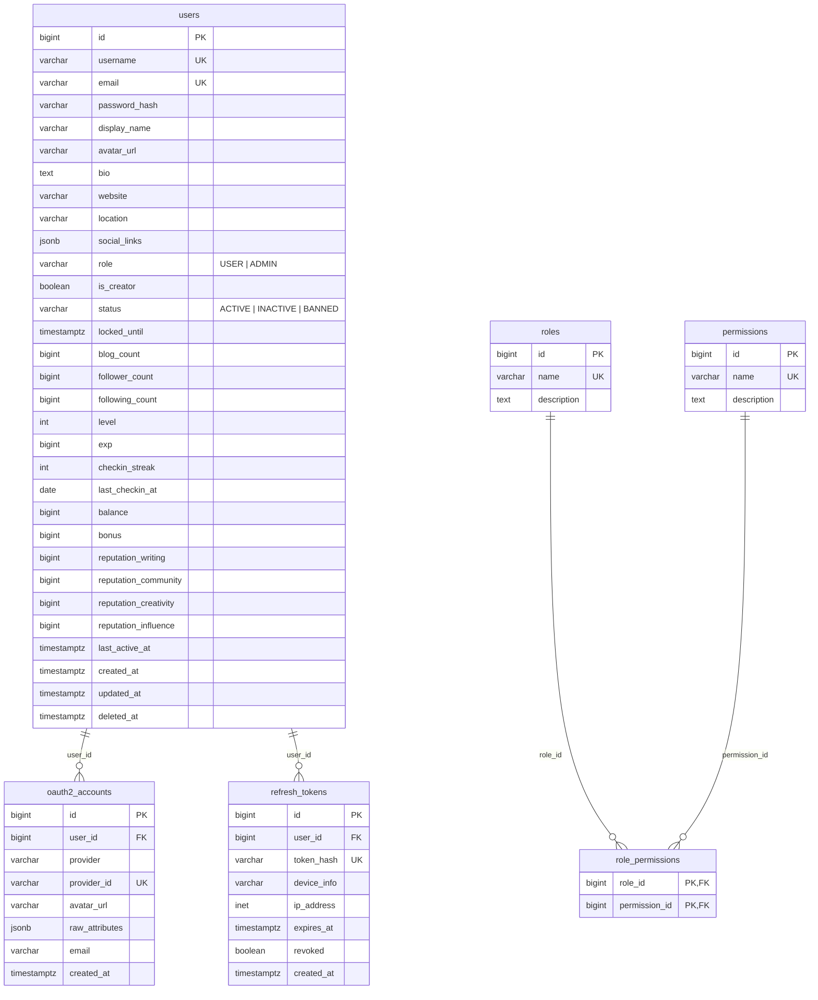

---

## 2. Content (11 tables)

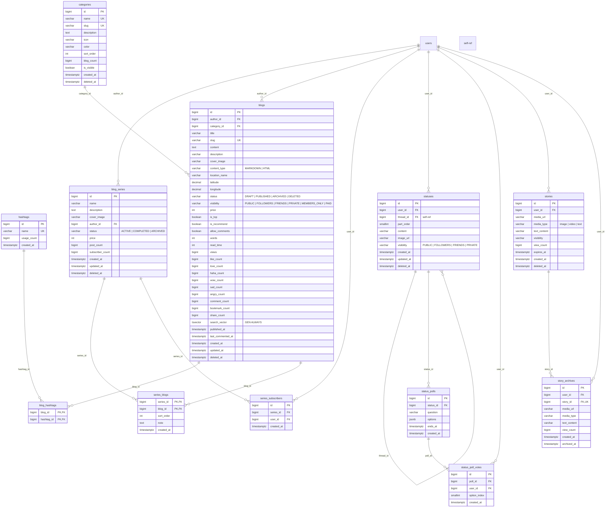

---

## 3. Comment (unified — `target_type` + `target_id`)

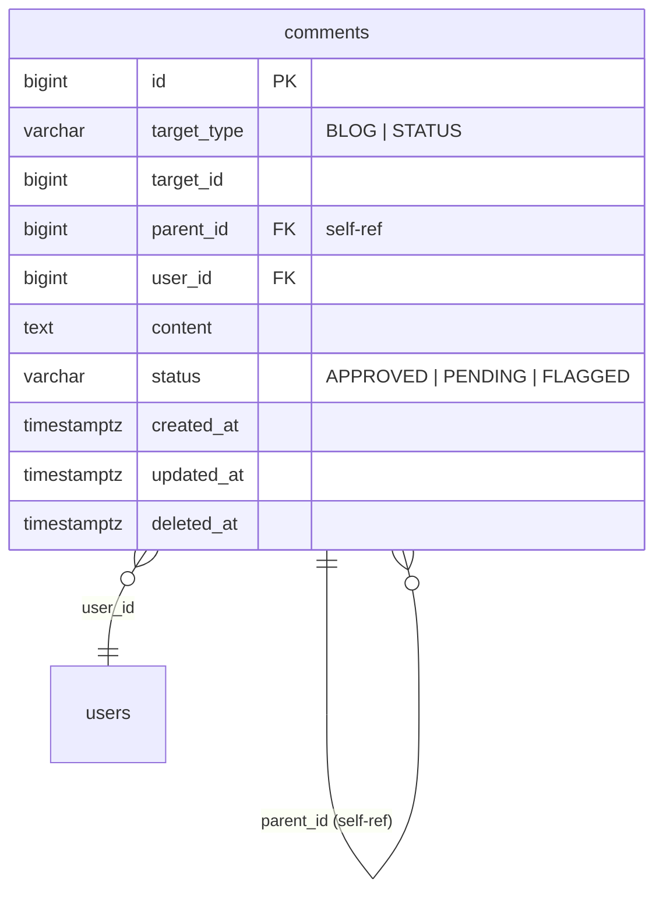

---

## 4. Social (5 tables)

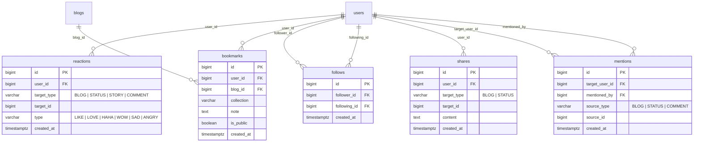

---

## 5. Gamification (4 tables)

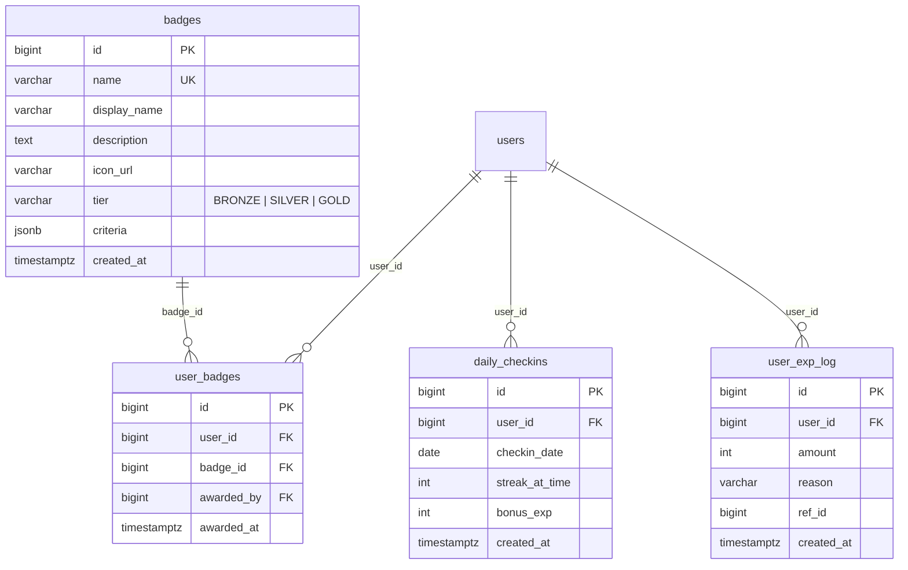

---

## 6. Notification (1 table)

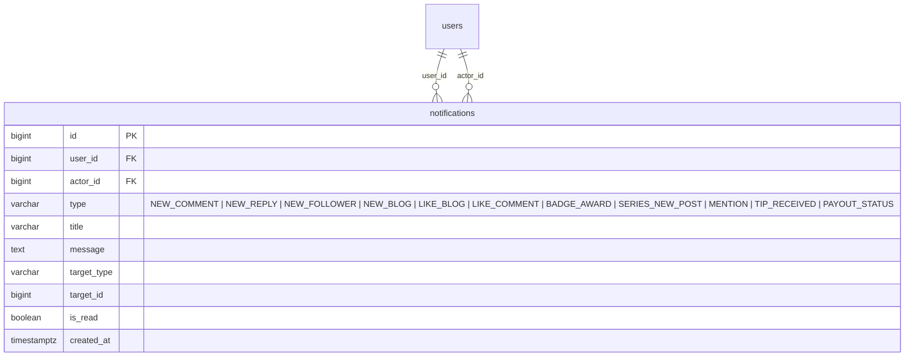

---

## 7. Analytics & Tracking (2 tables)

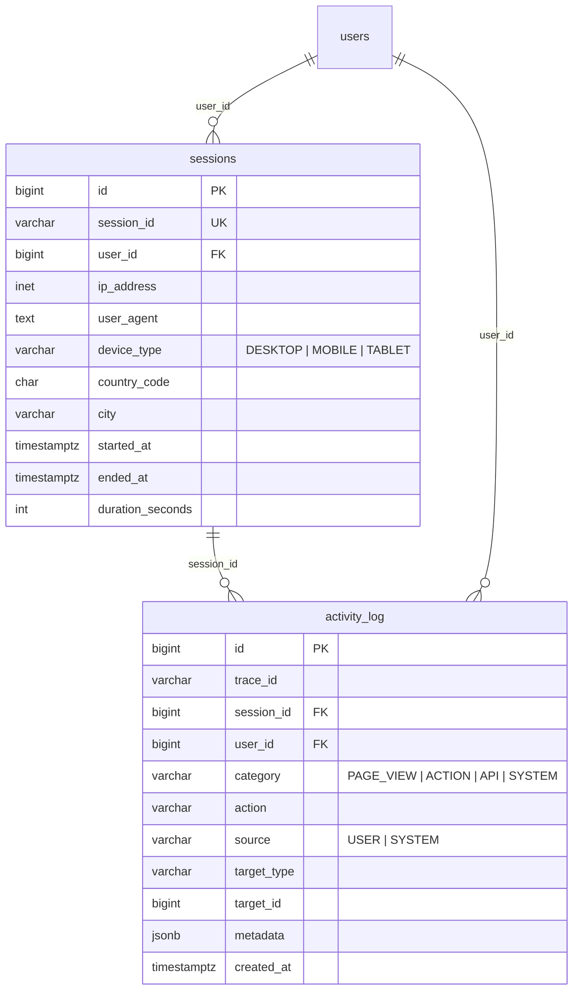

---

## 8. System (3 tables)

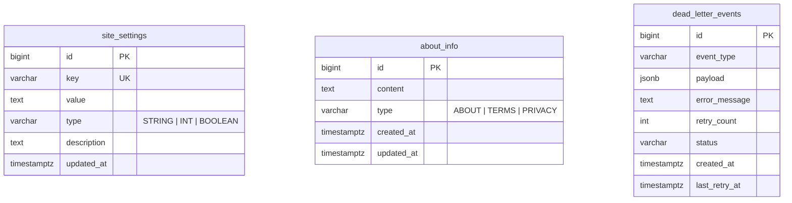

---

## 9. Canvas & Playlist (5 tables)

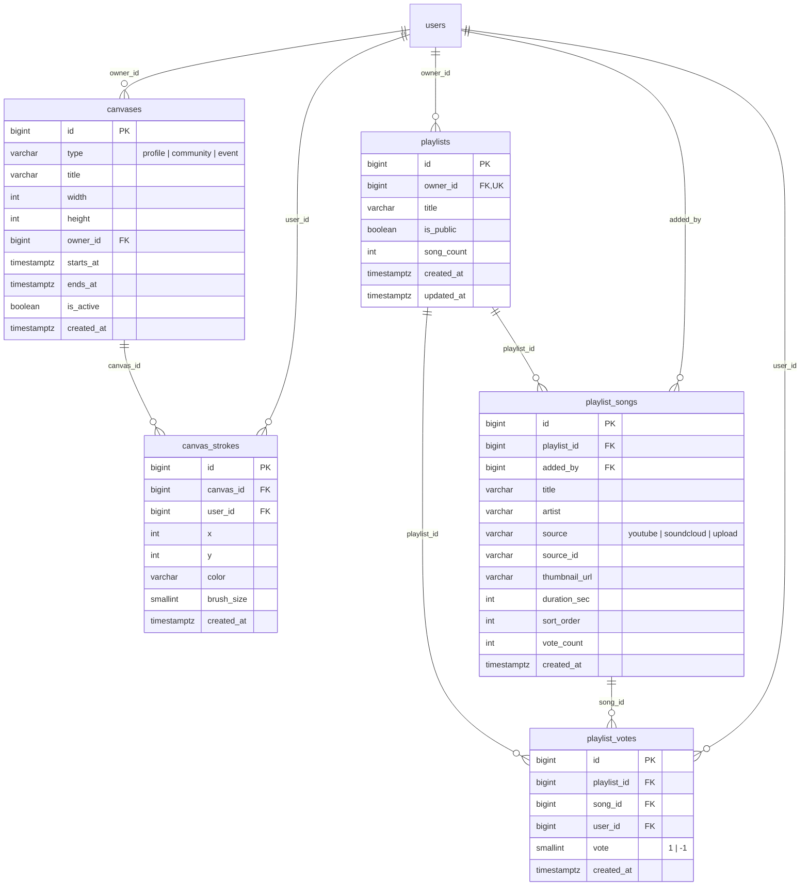

---

## 10. Profile, Skill, Quest, Shop, Blind (10 tables)

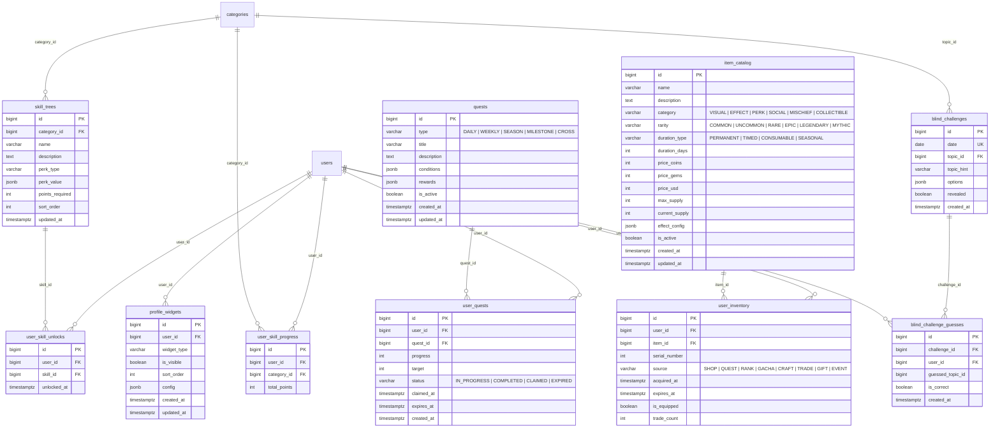

---

## 11. Materialized View

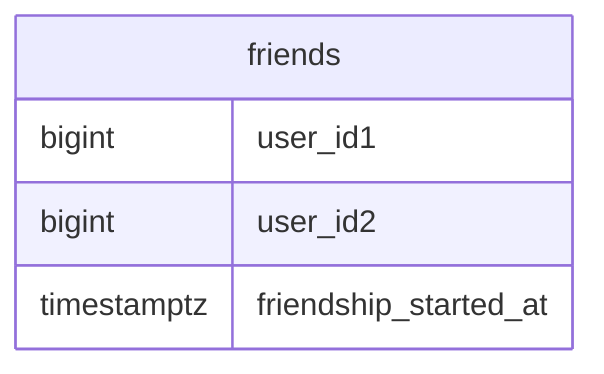

`friends` — mutual follow (user A follows B AND B follows A). REFRESH MATERIALIZED VIEW CONCURRENTLY on every follow/unfollow.

---

## Summary

| Module | Tables | Key Tables |
|--------|--------|------------|
| Auth & User | 6 | `users`, `oauth2_accounts`, `refresh_tokens` |
| Content | 11 | `blogs`, `categories`, `hashtags`, `statuses`, `stories` |
| Comment | 1 | `comments` (unified `target_type` + `target_id`) |
| Social | 5 | `reactions`, `bookmarks`, `follows`, `shares`, `mentions` |
| Gamification | 4 | `badges`, `daily_checkins`, `user_exp_log` |
| Notification | 1 | `notifications` |
| Analytics | 2 | `sessions`, `activity_log` |
| System | 3 | `site_settings`, `about_info`, `dead_letter_events` |
| Canvas & Playlist | 5 | `canvases`, `playlists`, `playlist_songs` |
| Extended Profile | 10 | `skill_trees`, `quests`, `item_catalog`, `blind_challenges` |
| **Total** | **48** | |

### Design patterns

- **Soft delete**: `deleted_at` on all entities — every query `WHERE deleted_at IS NULL`
- **Unified relations**: `comments`, `reactions`, `shares`, `mentions` use `target_type` + `target_id` (polymorphic FK)
- **Denormalized counters**: `blogs.views`, `users.follower_count` — updated via `syncCounters()` job
- **Triggers**: `update_updated_at_column()` on 7 tables, `refresh_friends_mv()` on follow changes
- **Search**: GIN index on `blogs.search_vector` (tsvector) with weighted title/description/content
- **Trending**: Index on `(views*3 + like_count*20 + comment_count*30 + bookmark_count*40 + share_count*50) DESC`
