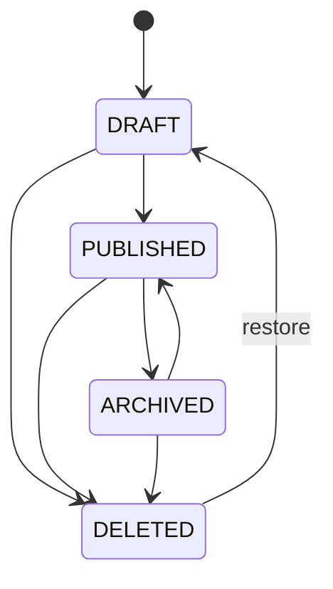

# 0x1lBlog — Backend Business Rules

> Ngày: 2026-06-21
> Trạng thái: Draft dùng làm nguồn đọc cho AI/backend
> Phạm vi: Backend nghiệp vụ, không mô tả UI

---

## 1. Product Direction

0x1lBlog là nền tảng social blogging:

- Nội dung chính là blog, series, comment, reaction, bookmark, follow, notification.
- Luồng phân phối nội dung lấy cảm hứng từ TikTok/Facebook: public feed, following feed, friend graph, trending, recommended content.
- Blog có thể chuyển sang creator/member/paid model trong phase sau, nhưng phase 1 không triển khai thanh toán.
- Backend ưu tiên nghiệp vụ rõ, dễ mở rộng, không khóa vào UI hiện tại.

Mục tiêu phase 1:

- User đăng ký, xác thực email, đăng nhập.
- User đã verified được viết blog, comment, reaction, bookmark, follow.
- Guest được đọc public content và comment nhưng không được tương tác.
- Notification dùng REST polling.
- Analytics ghi đủ page/action/api/system activity để phục vụ monitor và phân tích sau.

---

## 2. Actor Model

### 2.1 Guest

Guest là người chưa đăng nhập.

Guest được phép:

- Xem blog `PUBLIC`.
- Xem danh sách comment đã được approve.
- Tìm kiếm nội dung public.
- Tạo session tracking.
- Ghi activity log cho page view, API call, action đọc nội dung.

Guest không được phép:

- Viết comment trong phase 1.
- Reaction blog/comment.
- Bookmark.
- Follow.
- Share dưới danh tính hệ thống.
- Truy cập `FOLLOWERS`, `FRIENDS`, `PRIVATE`, `MEMBERS_ONLY`.

Quyết định: phase 1 chọn `1A` và `2B`: guest chỉ đọc, không tương tác. Lý do là nền tảng social cần identity rõ cho moderation, notification, anti-spam và graph follow/friend.

### 2.2 Registered User

User đã đăng ký nhưng chưa verify email.

Được phép:

- Login.
- Đọc content như user thường nếu content không yêu cầu quyền đặc biệt.
- Cập nhật profile cơ bản.

Không được phép:

- Tạo blog.
- Comment.
- Reaction.
- Follow.
- Bookmark.

Quyết định: phase 1 chọn `7B`: phải verify email mới được viết/tương tác. Điều này giảm spam và làm notification/moderation sạch hơn.

### 2.3 Verified User

Verified user là actor chính của phase 1.

Được phép:

- Tạo/sửa/xóa mềm blog của chính mình.
- Publish blog theo visibility được hỗ trợ.
- Comment và reply.
- Reaction blog/comment.
- Bookmark blog.
- Follow/unfollow user khác.
- Nhận notification.
- Xem following feed.

### 2.4 Admin

Admin quản trị nội dung, user, moderation, settings, analytics.

Admin được phép:

- Xem tất cả content và trạng thái.
- Restore soft-deleted content trong chính sách lưu giữ.
- Khóa/mở user.
- Moderate comment/blog.
- Xem activity monitor.
- Cấu hình site settings.

### 2.5 Creator

`is_creator` không phải role.

Trong phase 1, `is_creator` chỉ là flag dự phòng, chưa điều khiển nghiệp vụ chính.

Phase sau có thể dùng creator để:

- Bật creator dashboard.
- Cho phép member-only content.
- Thống kê subscriber/revenue.
- Apply/approve creator mode.

Quyết định: phase 1 chưa dùng `is_creator` trong authorization chính. Không nên để creator làm rối role model khi paid/member chưa triển khai.

---

## 3. Role And Permission Model

Source of truth phase 1:

- `users.role` dùng cho role coarse-grained: `USER`, `ADMIN`.
- `roles`, `permissions`, `role_permissions` giữ cho phase mở rộng RBAC.

Rule:

- Code phase 1 check role đơn giản trước.
- Không viết logic nghiệp vụ phụ thuộc lẫn lộn cả `users.role` và bảng RBAC nếu chưa có policy rõ.
- Nếu dùng RBAC ở phase sau, cần migration strategy để tránh hai nguồn quyền mâu thuẫn.

Khuyến nghị:

- Phase 1: giữ `users.role` làm nguồn quyền runtime.
- Phase 2: nếu cần admin granular permission, chuyển sang RBAC đầy đủ.

---

## 4. Blog Visibility

Visibility nên phản ánh social graph, không chỉ trạng thái public/private.

Đề xuất enum nghiệp vụ:

- `PUBLIC`: ai cũng xem được, kể cả guest.
- `FOLLOWERS`: chỉ follower của author xem được.
- `FRIENDS`: chỉ quan hệ follow hai chiều xem được.
- `PRIVATE`: chỉ author và admin xem được.
- `MEMBERS_ONLY`: dành cho creator/member/paid phase sau.

Nếu DB hiện tại đang có `PUBLIC`, `PRIVATE`, `MEMBERS_ONLY`, `PAID`, cần cân nhắc migration để thay `PAID` bằng business concept rõ hơn. `PAID` là cơ chế thanh toán, không phải visibility tự nhiên. `MEMBERS_ONLY` phù hợp hơn để biểu diễn quyền đọc theo membership.

### 4.1 Public

Được đọc bởi:

- Guest.
- User.
- Author.
- Admin.

Xuất hiện trong:

- Public feed.
- Search.
- Trending.
- Profile public.

### 4.2 Followers

Được đọc bởi:

- Author.
- Admin.
- User đang follow author.

Không được đọc bởi:

- Guest.
- User không follow.

### 4.3 Friends

Friend là follow hai chiều.

Được đọc bởi:

- Author.
- Admin.
- User có quan hệ mutual follow với author.

Không cần thêm bảng friend riêng nếu đã có bảng `follows`; có thể dùng materialized view `friends`.

### 4.4 Private

Chỉ author và admin đọc được.

Không xuất hiện trong feed/search/trending public.

### 4.5 Members Only

Phase 1:

- Chỉ giữ enum/field.
- Không triển khai thanh toán.
- Không cho user thường tạo `MEMBERS_ONLY` nếu chưa bật creator/membership feature.

Phase sau:

- Author phải là approved creator.
- Reader phải có active membership/subscription hoặc unlock entitlement.

### 4.6 Series Visibility

Series nên có visibility riêng, nhưng blog con vẫn cần quyền đọc riêng.

Rule đề xuất:

- Series visibility là quyền vào trang series/list.
- Blog visibility là quyền đọc bài cụ thể.
- Quyền đọc cuối cùng = phải qua cả series gate và blog gate nếu blog nằm trong series.

Ví dụ:

- Series `PUBLIC`, blog con `FOLLOWERS`: guest thấy series nhưng không đọc được bài followers-only.
- Series `MEMBERS_ONLY`, blog con `PUBLIC`: user không phải member không vào được series page member, nhưng nếu blog public được mở độc lập thì cần policy rõ.

Khuyến nghị phase 1:

- Series hỗ trợ `PUBLIC`, `PRIVATE`.
- Chưa bật `MEMBERS_ONLY` cho series.
- Khi blog thuộc private series, blog không được public trong feed nếu policy chưa rõ.

---

## 5. Blog Status State Machine

Blog status là trạng thái vòng đời nội dung, khác với visibility.

Đề xuất:



### 5.1 Draft

- Chỉ author/admin xem.
- Không xuất hiện trong feed/search/trending.
- Có thể sửa tự do.

### 5.2 Published

- Có thể xuất hiện trong feed/search/trending tùy visibility.
- Tính counter, notification, indexing.

### 5.3 Archived

Archived nghĩa là author muốn ngừng phân phối chủ động, không phải xóa.

Quyết định đề xuất cho câu `5`:

- Archived vẫn có thể đọc bằng URL nếu người đọc đủ quyền visibility.
- Archived không xuất hiện trong feed/search/trending/profile list mặc định.
- Archived không nhận thêm promotion/recommendation.
- Author có thể unarchive về `PUBLISHED`.

Lý do: đây là hành vi hợp lý nhất cho blog. Nó khác `PRIVATE` vì người có link vẫn đọc được nếu đủ quyền, và khác `DELETED` vì không mất nội dung.

### 5.4 Deleted

Soft delete.

Quyết định: chọn `6A`.

- Owner/admin restore trong 90 ngày.
- Sau 90 ngày có thể hard delete bằng job hoặc chuyển sang retained tombstone tùy policy.
- Deleted không đọc được bởi public.
- Admin vẫn xem được audit metadata.

---

## 6. Comment Rules

### 6.1 Comment Permission

Phase 1:

- Guest không được comment.
- Registered but unverified user không được comment.
- Verified user được comment.
- Admin có thể moderate.

### 6.2 Comment Approval

Quyết định: chọn `9A`.

- Comment của verified user auto approve.
- Nếu user bị flag/spam/restricted thì có thể chuyển sang pending bằng moderation policy phase sau.
- Admin có thể hide/delete/restore comment.

### 6.3 Reply Depth

Giải thích câu `10`:

- "Reply có được reply vào reply không?" nghĩa là comment có lồng nhiều cấp không.
- Ví dụ: A comment bài viết, B reply A, C reply B.

Có 3 cách:

- 2 cấp: comment gốc và reply. Reply không tạo cây sâu nữa.
- Nested vô hạn: reply vào reply đến vô hạn.
- UI flatten: DB lưu parent bất kỳ, nhưng UI hiển thị phẳng dưới comment gốc.

Khuyến nghị phase 1:

- Backend cho phép tối đa 2 cấp: root comment + reply.
- Không cho reply vào reply tạo tầng thứ ba.

Lý do:

- Dễ moderation.
- Dễ phân trang.
- Dễ notification.
- Tránh query recursive phức tạp.

Nếu muốn mention người đang được trả lời, dùng `mentions` thay vì nested sâu.

---

## 7. Reaction Rules

### 7.1 Blog Reaction

Reaction nên giống Facebook:

- User chỉ có một reaction active trên một blog.
- Nếu click cùng reaction đang có: bỏ reaction.
- Nếu click reaction khác: đổi type.
- Counter giảm/tăng tương ứng trong cùng transaction hoặc bằng counter strategy được quy định.

Ví dụ:

- User chọn `LIKE` lần đầu: tạo reaction `LIKE`.
- User chọn `LIKE` lần nữa: xóa reaction.
- User đang `LIKE`, chọn `LOVE`: update `LIKE` thành `LOVE`.

### 7.2 Comment Reaction

Áp dụng cùng rule với blog reaction.

### 7.3 Guest Reaction

Guest không được reaction phase 1.

---

## 8. Follow And Friend Rules

Follow nên giống TikTok cho phase 1:

- Follow ngay, không cần approval.
- Unfollow ngay.
- Không có private account phase 1.
- Friend là mutual follow, không phải một action riêng.

Nếu phase sau có private account:

- Follow private user tạo request pending.
- Accepted request mới thành follow active.

Rule phase 1:

- User không được follow chính mình.
- Follow trùng là idempotent.
- Unfollow trùng là idempotent.
- Mutual follow được tính từ bảng `follows` hoặc materialized view `friends`.

---

## 9. Bookmark Rules

- Verified user được bookmark blog.
- Guest không được bookmark.
- Bookmark click lại thì remove.
- Bookmark không nên public mặc định.
- Bookmark count có thể hiển thị hoặc chỉ dùng ranking, tùy product policy.

Khuyến nghị:

- Hiển thị bookmark count cho author/admin.
- Public list chỉ hiện reaction/comment/view/share count trước.

---

## 10. Share Rules

Phase 1:

- Share là action tracking, chưa cần social repost đầy đủ.
- Logged-in user share thì ghi actor user.
- Guest share external link thì chỉ ghi activity/session, không ghi social share entity gắn user.

Phase sau:

- Có thể thêm repost/quote-post nếu muốn social network mạnh hơn.

---

## 11. Notification Rules

Quyết định: chọn `13A` và `14 all`.

Phase 1 dùng REST polling:

- Client gọi API lấy notification mới theo cursor/time.
- Không dùng WebSocket cho phase 1.

Notification bắt buộc:

- Blog có comment mới.
- Comment có reply mới.
- Blog reaction.
- Comment reaction.
- New follower.
- Mention trong blog/comment.
- Admin/moderation notification nếu có.

Dedup rule:

- Không notify actor về hành động của chính actor.
- Reaction nhiều lần bởi cùng user trên cùng target nên update/dedup, không spam notification.
- Comment/reply tạo notification riêng.

Read rule:

- Notification có `read_at`.
- Mark single read.
- Mark all read.

---

## 12. Feed Rules

Phase 1 nên làm luôn feed cơ bản.

### 12.1 Public Feed

Nguồn:

- Blog `PUBLISHED`.
- Visibility `PUBLIC`.
- Không archived/deleted.

Sort:

- Default newest.
- Có thể thêm score dựa trên view/reaction/comment sau.

### 12.2 Following Feed

Quyết định: làm phase 1 ở mức đơn giản.

Nguồn:

- Blog của authors mà user đang follow.
- Blog `PUBLISHED`.
- Visibility user đủ quyền đọc: `PUBLIC`, `FOLLOWERS`, hoặc `FRIENDS` nếu mutual follow.

Sort:

- Newest trước.

### 12.3 Trending

Quyết định: làm phase 1 ở mức basic.

Nguồn:

- Blog public published không archived/deleted.

Score gợi ý:

```text
score = view_count * 1
      + reaction_count * 4
      + comment_count * 6
      + bookmark_count * 5
      + share_count * 8
      - age_decay
```

Implementation phase 1:

- Tính bằng SQL/order trên counter hiện có.
- Chưa cần ranking service riêng.

---

## 13. Search Rules

Phase 1:

- Search chỉ trả blog user có quyền đọc.
- Guest chỉ thấy `PUBLIC`.
- User thấy `PUBLIC`, own private, followers/friends content đủ quyền.
- Deleted không search.
- Archived mặc định không search, trừ khi filter riêng cho author/admin.

---

## 14. Moderation Rules

Phase 1 tối thiểu:

- Admin có thể hide/delete comment.
- Admin có thể lock/suspend user.
- Suspended user không được tạo blog/comment/reaction/follow/bookmark.
- Deleted content vẫn giữ audit fields.

Khuyến nghị bổ sung:

- Thêm report content phase sau.
- Thêm spam/rate-limit theo session/user/ip.

---

## 15. Rate Limit Rules

Rate limit cần có ngay cả khi chưa triển khai phức tạp.

Gợi ý phase 1:

- Login: theo IP + username/email.
- Register: theo IP.
- Comment: theo user + blog.
- Reaction: theo user + target.
- Follow: theo user.
- Activity log API calls: sampling hoặc batch insert nếu tải cao.

---

## 16. Business Invariants

Các invariant backend phải giữ:

- User chưa verify không được tạo tương tác social.
- Guest không được tạo entity social.
- Một user chỉ có một reaction active trên một target.
- Một user chỉ bookmark một blog một lần.
- Một user chỉ follow một target một lần.
- User không follow chính mình.
- Deleted content không xuất hiện ở public APIs.
- Archived content không xuất hiện trong distribution surfaces.
- Visibility luôn được check ở query/service layer, không dựa vào frontend.
- Counter không được âm.
- Notification không gửi cho chính actor.

---

## 17. Recommended Phase 1 Scope

Nên làm:

- Auth + email verification.
- Blog CRUD + publish/archive/restore.
- Visibility: `PUBLIC`, `FOLLOWERS`, `FRIENDS`, `PRIVATE`.
- Series: `PUBLIC`, `PRIVATE`.
- Comment 2 cấp, auto approve verified user.
- Blog/comment reaction kiểu Facebook.
- Bookmark.
- Follow/unfollow kiểu TikTok.
- Friend = mutual follow.
- Notification REST polling.
- Public feed.
- Following feed basic.
- Trending basic.
- Activity log full page/action/api/system.
- Counter strategy tối ưu.

Chưa nên làm:

- Paid unlock.
- Membership billing.
- WebSocket notification.
- Private account follow approval.
- Deep nested comments.
- Complex recommendation engine.
- Creator monetization dashboard.

